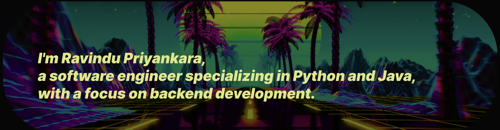

  
  

 

  

## 🚀 About Me

 
 I am a backend developer with a passion for building robust and scalable systems. With 4 years of experience in the field, I've worked on various projects ranging from API development to database optimization.

  
<h style = "color:#0A67F3">
  👩‍💻 I'm currently working on </h> : <h style = "color:red">My freelancing projects** </h>
   
<h style = "color:#0A67F3">
  🧠 I'm currently learning </h> : <h style = "color:red"> Algorithms Development to enhance my problem-solving skills and optimize the efficiency of my code. </h>

  👯‍♀️ I'm looking to collaborate on **Opensource Projects to contribute to the community and expand my knowledge in software development.**

  💬 Ask me about **anything related to backend development, Python, Java, or freelancing experiences—I'm always happy to share my insights and help others grow.**

📫 How to reach me via [h.h.a.r.p.premachandra@gmail.com](h.h.a.r.p.premachandra@gmail.com) or connect with me on [LinkedIn](https://www.linkedin.com/in/ravindu-priyankara-8b4449223/)—I'm looking forward to hearing from you!

😄 Pronouns...

⚡️ Fun fact...

