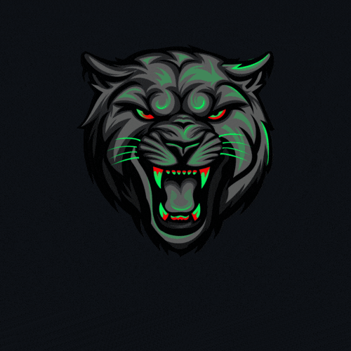

  
  

 

  

## 🚀 About Me

$${\color{lightblue}Welcome \space I \space  am\space  a\space  backend\space  developer\space  with\space  a\space  passion\space  for\space  building\space  robust\space  and\space scalable\space  systems.\space  With\space  4\space  years\space  of\space  experience}$$
$${\color{lightblue}in\space  the\space  field,\space  I've\space  worked\space  on\space  various\space  projects\space  ranging\space  from\space  API\space  development\space  to\space  database\space  optimization.}$$
  

$${\color{lightblue}👩‍💻\space I'm\space currently\space working\space on\color{red} :\color{orange} My\space freelancing\space projects}$$
 

$${\color{lightblue}🧠 \space I'm\space currently\space learning\color{red}  :\color{orange}  Algorithms\space Development\space to\space enhance\space my\space problem-solving\space skills\space and\space optimize\space the\\  efficiency\space of\space my\space code.\space }$$
 

👯‍♀️ I'm looking to collaborate on : Opensource Projects to contribute to the community and expand my knowledge in software development.

💬 Ask me about : anything related to backend development, Python, Java, or freelancing experiences—I'm always happy to share my insights and help others grow.
 

⚡️ Fun fact :  I'm intrigued by the mysteries of the world, from exploring abandoned places to delving into the realm of ghost hunting. There's an undeniable thrill in uncovering the unknown and unraveling the secrets that lie beneath the surface. Whether it's investigating paranormal phenomena or seeking out hidden treasures, I'm always up for an adventure that promises to challenge perceptions and ignite the imagination.

$${\color{red}Welcome \space \color{lightblue}To \space \color{orange}Stackoverflow}$$